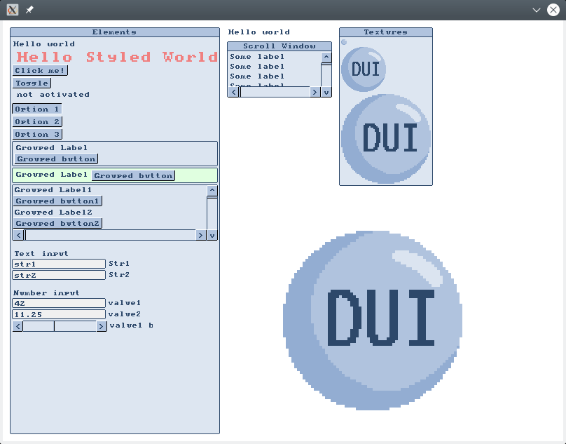
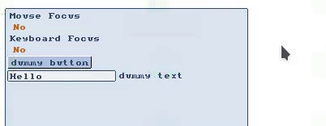

Direct User Interface
=====================

A simple immediate mode user interface designed for using with SDL2 2d renderer.



<!-- Latest download here (put link to singleheader version and the file itself,
and link for online docs) -->

The project <!--also--> can be used as it is, just by downloading or checking
out the current version. Be aware though that it might have some breakage and
bugs as it still a very early stage project;

Introduction
------------

We aim to provide a simple non intrusive way to define simple user interfaces,
based on rows. The following is a minimal example:

```cpp
#include <SDL.h>
#include "dui.hpp"

int
main(int argc, char** argv)
{
   // Init SDL
  SDL_Init(SDL_INIT_VIDEO);
  SDL_Window* window = nullptr;
  SDL_Renderer* renderer = nullptr;
  SDL_CreateWindowAndRenderer(800, 600, SDL_WINDOW_SHOWN, &window, &renderer);
  
  // Create ui state
  dui::State state{renderer};

  // Main loop
  for (;;) {
    //Event handling
    SDL_Event ev;
    while (SDL_PollEvent(&ev)) {
      // Send event to the state
      state.event(ev);

      if (ev.type == SDL_QUIT) {
        return 0;
      }
    }

    // Begin frame
    auto f = dui::frame(state);

    // Add elements
    dui::label(f, "Hello World", {350, 200});
    if (dui::button(f, "Close App", {350, 220})) {
      return 0;
    }

    SDL_SetRenderDrawColor(renderer, 255, 255, 255, 255);
    SDL_RenderFillRect(renderer, nullptr);

    // End frame and render state
    f.render();

    SDL_RenderPresent(renderer);
    SDL_Delay(1);
  }
  return 1;
}
```

Let's dissect the code. Firstly we have the include. We just use the `dui.hpp`
that includes all the necessary files. We could also use the dui
`dui_single.hpp` that is the single file version so it is easier to attach on a
project.

```cpp
#include "dui.hpp"
```

Then we create the State just before the main loop. A state holds all persistent
UI data, like the mouse position, if it is pressed, as well as the current
active element and so on. Think it as the main ui component.

```cpp
  // Create ui state
  dui::State state{renderer};

  // Main loop
  for (;;) {
    ...
  }
```

We need to send the events to the state, so it knowns the mouse and keyboard
status and store it for the elements.

```cpp
    //Event handling
    SDL_Event ev;
    while (SDL_PollEvent(&ev)) {
      // Send event to the state
      state.event(ev);

      ...
    }
```

After all events are received, we can then
begin the frame and add elements:

```cpp
    // Begin frame
    auto f = dui::frame(state);

    // Add elements
    dui::label(f, "Hello World", {350, 200});
    if (dui::button(f, "Close App", {350, 220})) {
      return 0;
    }
```

The frame starts with the creation of a Frame object, which is done by frame()
auxiliary function. Then when appropriated, we can call render() on it, which
ends the frame and render it.

```cpp
    // Clear screen
    SDL_SetRenderDrawColor(renderer, 255, 255, 255, 255);
    SDL_RenderFillRect(renderer, nullptr);

    // End frame and render state
    f.render();
```

This is all what we need to get the following rendering. The button
even works!


You can see this example complete with better error handling at
[hello_demo.cpp][hello_demo]

[hello_demo]: examples/hello_demo.cpp

### How to know when DUI is using the Mouse and Keyboard

<!-- Explain why we want to know about mouse and keyboard, explain it is a good
time to introduce panels, then show the necessary changes -->



<!-- Link to complete examples, explain with colors -->

Build
-----

You need only to have a C++17 compiler and SDL library installed. The library
itself is header only, but we use CMake to build examples and the single file
header:

### Building examples

### Building single file header

Elements
--------

<!-- List and explain all elements we support -->

Contributing
------------

<!-- TODO -->

Credits
-------

- font.h: CC0 (Public domain) from
  <https://opengameart.org/content/8x8-1bit-roguelike-tiles-bitmap-font>
