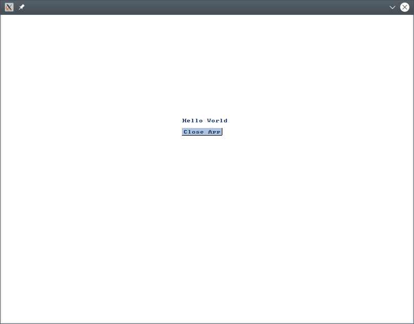

Direct User Interface
=====================

A simple immediate mode user interface designed for using with SDL2 2d renderer.

<!-- Latest download here (put link to singleheader version and the file itself,
and link for online docs) -->

The project <!--also--> can be used as it is, just by downloading or checking
out the current version. Be aware though that it might have some breakage and
bugs as it still a very early stage project;

Introduction
------------

We aim to provide a simple non intrusive way to define simple user interfaces,
based on rows.

<!-- Here code with skeleton of SDL code. -->

Then we can easily put a State just before the main loop. A state holds all
persistent UI data, like the mouse position, if it is pressed, as well as the
current active element and so on. Think it as the main ui component.

<!-- Here we add State creation and event handling code -->

We need to send the events to the state, so it can known the mouse and keyboard
status and store it for the elements. After all events are received, we can then
start the frame:

<!-- Frame begin and .render() -->

The frame starts with the creation of a Frame object, which is done by frame()
auxiliary function. Then when appropriated, we can call render() on it, which
ends the frame and render it. Between these two, we add our elements:

<!-- Label -->

(Label explanation. Comment it is too little to matter, so we need button)

<!-- button -->

(How button works.)

Conclusion, link to example and image

<!-- Link to complete example here -->

### How to know when DUI is using the Mouse and Keyboard

<!-- Explain why we want to know about mouse and keyboard, explain it is a good
time to introduce panels, then show the necessary changes -->

<!-- Link to complete examples, explain with colors -->

Build
-----

<!-- TODO -->

Elements
--------

<!-- List and explain all elements we support -->

Contributing
------------

<!-- TODO -->

Credits
-------

- font.h: CC0 (Public domain) from
  <https://opengameart.org/content/8x8-1bit-roguelike-tiles-bitmap-font>
